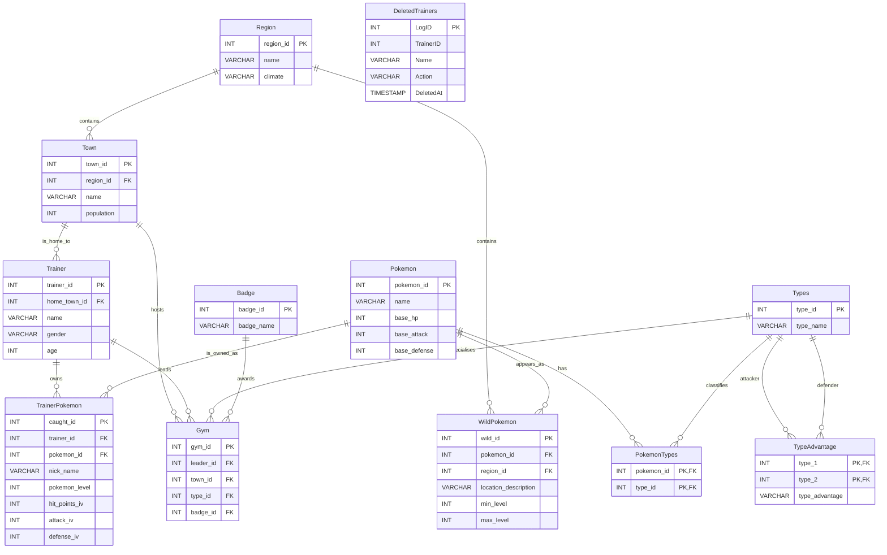

# Pokémon Database System

A MySQL and Java JDBC database system for managing Pokémon, trainers, regions, gyms, wild encounters, and trainer-owned
Pokémon.

The system combines a normalised relational database, database-side business logic, example operational queries, and a
Java console application for querying data through JDBC.

## Features

- Normalised MySQL schema for regions, towns, trainers, Pokémon species, types, gyms, badges, wild encounters, and owned
  Pokémon.
- Many-to-many Pokémon type mapping through a junction table.
- Foreign key constraints for relational integrity.
- Seed data for the main game-domain entities.
- SQL views for reusable reporting and calculated Pokémon stats.
- Stored procedures for adding Pokémon and trainers with starter Pokémon.
- Transaction-based procedures for trading Pokémon and moving wild Pokémon into trainer ownership.
- Triggers for level limits, IV caps, trainer party limits, delete handling, leader reassignment, and audit logging.
- Indexes with `EXPLAIN` examples for query-plan review.
- MySQL user and privilege scripts for role-based access control.
- Java console application with formatted query output.

## Tech Stack

- Java
- JDBC
- MySQL
- MySQL Connector/J
- SQL

## Repository Structure

```text
Pokemon_Database/
├── README.md
├── lib/
│   └── mysql-connector-j-9.4.0.jar
├── src/
│   └── main/
│       └── java/
│           ├── DBCommand.java
│           ├── DBConnect.java
│           ├── DBOutputFormatter.java
│           └── Main.java
└── sql/
    ├── 00_all.sql
    ├── 01_schema.sql
    ├── 02_seed_data.sql
    ├── 03_views.sql
    ├── 04_stored_procedures.sql
    ├── 05_transactions.sql
    ├── 06_triggers.sql
    ├── 07_indexes.sql
    ├── 08_users.sql
    └── examples/
        ├── data_modification_queries.sql
        └── reporting_queries.sql
```

## Database Model

The database is built around a Pokémon game domain:

- `Region` stores world regions.
- `Town` belongs to a region.
- `Trainer` belongs to a home town.
- `Pokemon` stores shared Pokémon species data and base stats.
- `Types` stores Pokémon type names.
- `PokemonTypes` maps Pokémon species to one or more types.
- `TrainerPokemon` stores trainer-owned Pokémon, including nickname, level, and IV values.
- `WildPokemon` stores catchable Pokémon by region and level range.
- `Gym`, `Badge`, and `TypeAdvantage` model gym and battle-related data.
- `DeletedTrainers` stores trainer deletion audit records.

## Entity Relationship Diagram



## SQL Scripts

`sql/00_all.sql` is the main set-up script for MySQL CLI usage. It runs the numbered set-up files in order:

```text
01_schema.sql
02_seed_data.sql
03_views.sql
04_stored_procedures.sql
05_transactions.sql
06_triggers.sql
07_indexes.sql
08_users.sql
```

The `sql/examples/` folder contains optional demonstration queries. These files are not included in `00_all.sql` because
`data_modification_queries.sql` changes and deletes data.

## Java Console Application

The Java application provides a menu for exploring the database:

1. Show Pokémon by type
2. Show trainers and their Pokémon
3. Show wild Pokémon by region
4. Show gyms and their leaders
5. Show calculated Pokémon stats from the `TrainerPokemonStats` view

The application uses:

- `DBConnect` for the MySQL connection
- `DBCommand` for executing SQL queries
- `DBOutputFormatter` for table-like console output
- `Main` for menu navigation and user input

## How to Run

### 1. Create the database

Open the MySQL CLI and run the main set-up script with an absolute path:

```sql
SOURCE
/Users/nikitsya/Desktop/Pokemon_Database/sql/00_all.sql;
```

`SOURCE` is a MySQL client command, so it is intended for the MySQL CLI. In database IDEs, run the numbered SQL files
manually in order.

### 2. Configure the Java database connection

Update the connection settings in:

```text
src/main/java/DBConnect.java
```

Set the MySQL database URL, username, and password for your local environment:

```java
private static final String DB_URL = "jdbc:mysql://127.0.0.1:3306/Pokemon";
private static final String USER = "root";
private static final String PASSWORD = "your_password";
```

### 3. Compile and run on macOS or Linux

From the project root:

```bash
javac -cp "lib/mysql-connector-j-9.4.0.jar" src/main/java/*.java -d out
java -cp "out:lib/mysql-connector-j-9.4.0.jar" Main
```

### 4. Compile and run on Windows

From the project root:

```bash
javac -cp "lib/mysql-connector-j-9.4.0.jar" src\main\java\*.java -d out
java -cp "out;lib/mysql-connector-j-9.4.0.jar" Main
```

## Example Queries

Show trainers and their Pokémon:

```sql
SELECT tr.name          AS Trainer,
       tr.gender,
       tr.age,
       p.name           AS Pokemon,
       tp.nick_name     AS Nickname,
       tp.pokemon_level AS Level
FROM TrainerPokemon AS tp
         JOIN Trainer AS tr ON tp.trainer_id = tr.trainer_id
         JOIN Pokemon AS p ON tp.pokemon_id = p.pokemon_id
ORDER BY tr.name;
```

Show calculated trainer Pokémon stats:

```sql
SELECT *
FROM TrainerPokemonStats;
```

Trade Pokémon between trainers:

```sql
CALL TradePokemon(1, 1, 8, 4);
```

## Project Status

The database schema, SQL set-up scripts, seed data, database logic, example queries, and Java query application are
implemented and ready to run locally with MySQL.
